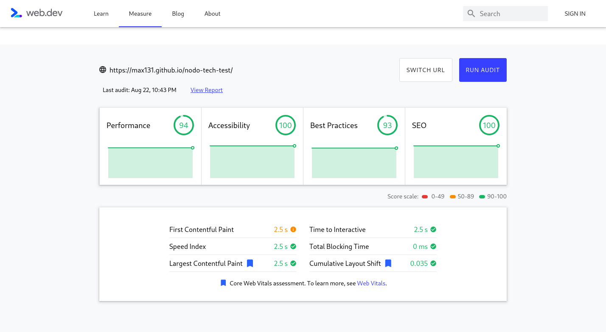

# Technical Test for Node

Layout design developed with vanilla HTML/CSS

What I use?

- [x] Semantic HTML
- [x] CSS variables
- [x] BEM
- [x] Media queries
- [x] First mobile design
- [x] Lazy loading images
- [x] SEO meta tags
- [x] OpenGraph SEO
- [x] OpenGraph SEO Image
- [x] JSON-LD Micro data SEO
- [x] WEBP Images for better performance
- [x] Validated HTML against [W3 HTML Validator](https://validator.w3.org/nu/?showsource=yes&showoutline=yes&showimagereport=yes&checkerrorpages=yes&useragent=Validator.nu%2FLV+http%3A%2F%2Fvalidator.w3.org%2Fservices&acceptlanguage=&doc=https%3A%2F%2Fmax131.github.io%2Fnodo-tech-test%2F)
- [x] Validated CSS against [W3 CSS Validator](https://jigsaw.w3.org/css-validator/validator?uri=https%3A%2F%2Fmax131.github.io%2Fnodo-tech-test&profile=css3svg&usermedium=all&warning=1&vextwarning=&lang=es)

## Web performance

Web performance tested with [web.dev](https://web.dev/measure/)

[View page](https://max131.github.io/nodo-tech-test)
